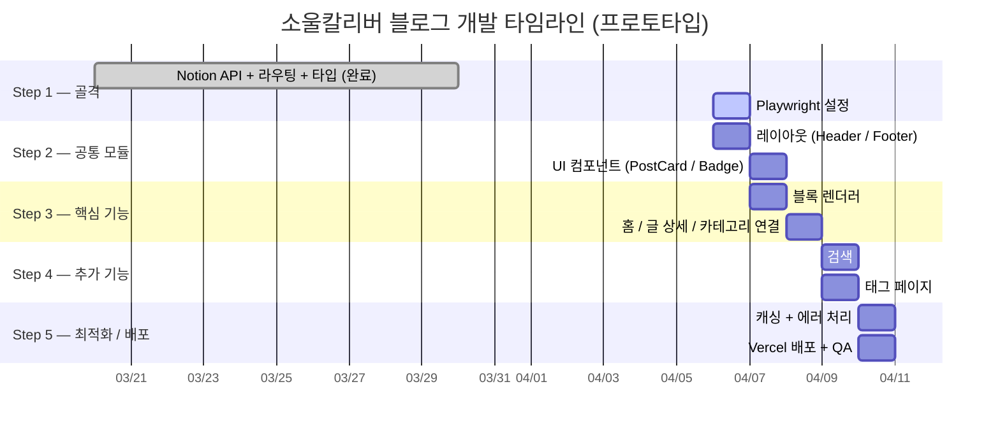
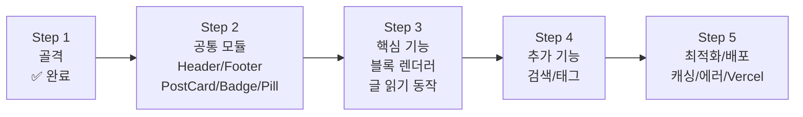

# ROADMAP.md

<!-- Last Updated: 2026-04-06 | Version: 1.4.0 -->

---

## 1. 프로젝트 개요

### 제품 비전

Notion을 CMS로 활용하여 소울칼리버 프레임 데이터, 캐릭터 자료, 대전 회고를 발행하는 개인 블로그. 별도 관리자 UI 없이 Notion 워크스페이스에서 글을 작성하면 웹에 자동 반영된다.

### 핵심 성공 지표 (KPI)

| 지표 | 목표 |
|------|------|
| Notion 연동 데이터 정확성 | 발행된 글 100% 정상 표시 |
| 페이지 로딩 (LCP) | 3초 이하 (Vercel Edge 기준) |
| 블록 렌더링 커버리지 | 주요 블록 타입 10종 이상 지원 |
| 검색 응답성 | 클라이언트 사이드 필터 즉시 반응 |
| 빌드 성공률 | main 브랜치 100% |

### 기술 스택

| 영역 | 기술 | 버전 |
|------|------|------|
| Framework | Next.js | 16.2.1 |
| Language | TypeScript | ^5 |
| Runtime | React | 19.2.4 |
| CMS | Notion API (`@notionhq/client`) | ^5.15.0 |
| Styling | Tailwind CSS | ^4 (zero-config) |
| UI Components | shadcn/ui (설치 완료, 미사용) | — |
| Icons | Lucide React | ^1.7.0 |
| Testing | Playwright (MCP) | latest |
| Deployment | Vercel | — |

### 팀 구성

1인 개발 (개인 프로젝트). 모든 역할(Frontend, DevOps, Design)을 단독 수행.

---

## 2. 개발 순서 철학

이 로드맵은 **"의존성 역순으로 막히지 않게"** 원칙으로 구성된다.

```
골격 → 공통 모듈 → 핵심 기능 → 추가 기능 → 최적화/배포
```

각 단계는 다음 단계의 전제 조건이다. 순서를 바꾸면 반드시 되돌아와야 하는 지점이 생긴다.

단계 간 의존성을 명시하면: Step 2의 `PostCard`는 Step 3 홈/카테고리 리팩터링에서 사용되고, Step 2의 `TagPill`은 Step 4 태그 페이지에서 사용된다. 이 방향성이 역순이 될 수 없는 이유다.

---

## 3. 마일스톤



---

## 4. 단계별 태스크

---

### Step 1 — 프로젝트 골격

> **왜 이 순서인가?**
> 골격이 없으면 그 위에 무엇도 쌓을 수 없다. 환경 변수 하나가 잘못되어도 Notion 데이터가 전혀 안 오고, 라우팅 구조가 흔들리면 나중에 URL을 전부 바꿔야 한다. 가장 먼저 "토대가 동작한다"는 것을 검증해야 이후 작업이 안전하다.

**상태**: ⚠️ 부분 완료 (Playwright 설정 미완료)

| Task | 복잡도 | 상태 |
|------|--------|------|
| Notion API 클라이언트 (`lib/notion.ts`) — search() 기반 쿼리 | M | ✅ |
| TypeScript 타입 정의 (`types/notion.ts`) | S | ✅ |
| App Router 페이지 구조 (`app/page.tsx`, `posts/[slug]`, `category/[category]`) | M | ✅ |
| 보안 헤더 설정 (`next.config.ts`) | S | ✅ |
| `.env.example` 작성 | S | ✅ |
| Playwright 설치 및 `playwright.config.ts` 설정 | S | 🔲 |
| `package.json` 테스트 스크립트 추가 (`test`, `test:ui`) | S | 🔲 |
| `tests/smoke.spec.ts` 홈 페이지 smoke test 작성 | S | 🔲 |

**완료 기준**: 환경 변수 설정 시 발행된 글 목록이 홈에 표시되고, smoke test가 통과한다.

---

### Step 2 — 공통 모듈

> **왜 이 순서인가?**
> PostCard, Header 같은 공통 컴포넌트는 핵심 기능(블록 렌더러)과 추가 기능(검색, 태그) 모두에서 사용된다. 나중에 만들면 이미 완성된 페이지들을 다시 열어서 컴포넌트를 끼워 넣는 작업이 생긴다. 한 번만 만들고 여러 곳에서 가져다 쓰는 구조를 먼저 확립한다.

**상태**: 🔲 미구현

#### 레이아웃 컴포넌트

| Task | 복잡도 | 역할 |
|------|--------|------|
| `Header` — 사이트 제목, 카테고리 네비게이션 링크 | M | Frontend |
| `Footer` — 저작권, 간단한 소개 | S | Frontend |
| `app/layout.tsx`에 Header / Footer 통합 | S | Frontend |

#### UI 프리미티브

| Task | 복잡도 | 역할 |
|------|--------|------|
| `PostCard` — 제목, 카테고리, 날짜, 태그 요약 표시 | S | Frontend |
| `CategoryBadge` — 카테고리 링크 배지 | S | Frontend |
| `TagPill` — 태그 링크 필 | S | Frontend |

**완료 기준**: 모든 페이지에 Header/Footer가 렌더링되고, PostCard/Badge/Pill이 독립적으로 사용 가능하다.

---

### Step 3 — 핵심 기능

> **왜 이 순서인가?**
> 이 블로그의 존재 이유는 "Notion에서 쓴 글을 웹에서 읽는 것"이다. 블록 렌더러 없이는 글 상세 페이지가 빈 화면이다. 검색이나 태그 필터링이 아무리 잘 돼도 글 본문을 못 읽으면 의미가 없다. 핵심 가치를 먼저 동작시키고 부가 기능을 붙인다.

**상태**: 🔲 미구현 (블록 렌더러 TODO 상태)

#### Story 3.1: 기본 블록 렌더링

소울칼리버 블로그 콘텐츠 특성을 반영한 우선순위로 구현한다.

| Task | 복잡도 | 우선순위 |
|------|--------|----------|
| `paragraph` — rich text, 링크, bold/italic | S | P0 |
| `heading_1/2/3` | S | P0 |
| `bulleted_list_item`, `numbered_list_item` (연속 항목 그룹핑) | M | P0 |
| `table` — 프레임 데이터 표 (소울칼리버 핵심 콘텐츠) | M | P1 |
| `code` — 언어 표시, 복사 버튼 | M | P1 |
| `image` — Next.js Image 컴포넌트 활용 | M | P1 |
| `callout` — 이모지 + 텍스트 강조 | S | P1 |
| `toggle` — 접기/펼치기 | M | P2 |
| `quote`, `divider` | S | P2 |
| 미지원 블록 타입 폴백 UI | S | P0 |

#### Story 3.2: 중첩 블록 처리

| Task | 복잡도 | 비고 |
|------|--------|------|
| `getPostContent`에 재귀 중첩 조회 추가 (`has_children` 확인) | L | depth 최대 2단계 제한 (Rate Limit 대응) |
| 중첩 블록 재귀 렌더링 (들여쓰기) | M | |

#### Story 3.3: BlockRenderer 통합 및 페이지 연결

| Task | 복잡도 | 비고 |
|------|--------|------|
| `BlockRenderer` 컴포넌트 작성 (블록 배열 → JSX) | M | |
| `app/posts/[slug]/page.tsx` TODO 제거 후 BlockRenderer 연결 | S | |
| 홈 페이지 PostCard로 리팩터링 | S | Step 2 산출물 활용 |
| 카테고리 페이지 PostCard로 리팩터링 | S | Step 2 산출물 활용 |

**완료 기준**: 글 상세 페이지에서 단락, 제목, 리스트, 테이블, 코드, 이미지가 올바르게 렌더링된다. Playwright MCP로 검증.

---

### Step 4 — 추가 기능

> **왜 이 순서인가?**
> 검색과 태그 필터링은 글 목록이 충분히 쌓였을 때 빛나는 기능이다. 핵심 기능(글 읽기)이 동작한 뒤에 추가해도 전혀 늦지 않다. 또한 검색 컴포넌트는 PostCard(Step 2)를, 태그 페이지는 TagPill(Step 2)을 의존하기 때문에 이 순서가 자연스럽다.

**상태**: 🔲 미구현

#### Story 4.1: 클라이언트 사이드 검색

서버에서 전체 글 목록을 가져온 뒤 클라이언트에서 인메모리 필터링 (ADR-004 참고).

| Task | 복잡도 | 역할 |
|------|--------|------|
| `SearchInput` — controlled input, debounce 300ms | S | Frontend |
| 제목 + 태그 기반 필터링 로직 | S | Frontend |
| 홈 페이지 내 인라인 검색 통합 | M | Frontend |
| 검색 결과 0건 Empty State UI | S | Frontend |

#### Story 4.2: 태그 페이지

| Task | 복잡도 | 역할 |
|------|--------|------|
| `getPostsByTag(tag)` lib 함수 추가 | S | Backend |
| `app/tags/[tag]/page.tsx` 구현 | S | Frontend |
| 글 상세 페이지 TagPill → 태그 페이지 링크 연결 | S | Frontend |

**완료 기준**: 검색창 입력 시 즉시 필터링되고, 태그 클릭 시 해당 태그 글 목록 페이지로 이동한다. Playwright MCP로 검증.

---

### Step 5 — 최적화 및 배포

> **왜 이 순서인가?**
> 캐싱과 에러 처리는 기능이 완성된 뒤에 얹는 것이 맞다. 아직 완성되지 않은 기능에 캐싱을 미리 붙이면 개발 중 stale 데이터 때문에 디버깅이 두 배로 어려워진다. 배포는 당연히 마지막이다 — 동작하는 것을 올린다.

**상태**: 🔲 미구현

#### Story 5.1: 캐싱 전략

| Task | 복잡도 | 역할 |
|------|--------|------|
| `getPosts` / `getPostsByCategory` / `getPostsByTag`에 `unstable_cache` 적용 | M | Backend |
| 글 상세 페이지 `revalidate` 설정 (3600초) | S | Backend |

#### Story 5.2: 에러 처리

| Task | 복잡도 | 역할 |
|------|--------|------|
| `app/error.tsx` — Notion API 실패 폴백 UI | S | Frontend |
| `app/not-found.tsx` — 커스텀 404 페이지 | S | Frontend |
| `lib/notion.ts` 함수에 try/catch + 콘솔 로깅 추가 | M | Backend |

#### Story 5.3: E2E 테스트 (Playwright MCP)

Playwright MCP 5단계 절차 적용: **Observe → Plan → Write → Execute → Verify**
실제 Notion API를 대상으로 테스트한다 (mock 사용 금지, ADR-006 참고).

| Task | 복잡도 | 역할 |
|------|--------|------|
| 홈 페이지 글 목록 로딩 | M | Frontend |
| 글 상세 페이지 블록 렌더링 | M | Frontend |
| 카테고리 페이지 필터링 | S | Frontend |
| 검색 기능 | S | Frontend |
| 태그 페이지 | S | Frontend |
| Notion API 실패 시 에러 폴백 UI | M | Frontend |

#### Story 5.4: SEO 최적화

글 상세 페이지에 `generateMetadata()`가 이미 구현되어 있으나, 검색 엔진 색인과 소셜 공유에 필요한 항목을 추가한다.

| Task | 복잡도 | 역할 |
|------|--------|------|
| OG 태그 / Twitter Card 메타데이터 추가 (`openGraph`, `twitter` 필드) | S | Frontend |
| `app/sitemap.ts` — 전체 글 URL 자동 생성 | S | Backend |
| `app/robots.ts` — 크롤러 허용 정책 설정 | S | Backend |
| 글 상세 페이지 `canonical` URL 확인 | S | Frontend |

#### Story 5.5: Vercel 배포

| Task | 복잡도 | 역할 |
|------|--------|------|
| Vercel 프로젝트 생성 및 GitHub 연동 | S | DevOps |
| Vercel 환경 변수 설정 (`NOTION_TOKEN`, `NOTION_DATABASE_ID`) | S | DevOps |
| 프로덕션 빌드 검증 (`next build` 로컬 통과) | S | DevOps |
| Lighthouse 점수 확인 (Performance 80+ 목표) | M | DevOps |

**완료 기준**: 전체 Playwright 스위트 통과, Vercel 프로덕션 URL에서 실제 Notion 콘텐츠가 정상 표시되고, Lighthouse SEO 점수 90+ 달성.

---

## 5. 기술 아키텍처 결정 사항 (ADR)

### ADR-001: App Router 채택 (Pages Router 대신)

**상태**: 결정됨
**컨텍스트**: Next.js 16 기준으로 Pages Router는 레거시 경로로 분류되며 신규 기능이 App Router에만 추가된다.
**결정**: App Router 사용. `app/` 디렉터리, 서버 컴포넌트 기본, Promise-based params.
**근거**: 장기 유지보수 측면에서 App Router가 표준 경로.
**기각된 대안**: Pages Router — 비권장 경로이며 Next.js 16 기능 제약 발생.

---

### ADR-002: Notion API v5 — search() 기반 데이터 조회

**상태**: 결정됨 (구현 완료)
**컨텍스트**: `@notionhq/client` v5에서 `databases.query()` API가 제거되었다.
**결정**: `notion.search()` + 클라이언트 사이드 `parent.database_id` 필터링으로 대체.
**근거**: v5 SDK를 사용하는 한 유일한 공식 대안.
**트레이드오프**: 워크스페이스 전체 검색 → 글 500건 초과 시 캐싱 전략 재검토 필요. **향후 개선 필요**.
**기각된 대안**: `databases.query()` — v5에서 존재하지 않음.

---

### ADR-003: 서버 컴포넌트 기반 데이터 페칭

**상태**: 결정됨
**결정**: 모든 Notion API 호출을 서버 컴포넌트에서 직접 수행. `'use client'`는 인터랙션이 필요한 컴포넌트에만 사용.
**근거**: API 키 클라이언트 노출 방지, JS 번들 크기 감소.
**기각된 대안**: 전용 API Route — 개인 블로그 규모에서 오버엔지니어링.

---

### ADR-004: 검색 — 클라이언트 사이드 인메모리 필터링

**상태**: 결정됨 (미구현)
**결정**: 서버에서 전체 글 목록 수신 → 클라이언트 컴포넌트에서 인메모리 필터링.
**근거**: 수백 건 규모에서 전체 목록이 수 KB. 별도 검색 인덱스 없이 즉시 구현 가능.
**트레이드오프**: 1000건 초과 시 초기 로딩 데이터 크기 문제. **향후 개선 필요**: Fuse.js 도입 검토.
**기각된 대안**: Algolia — 소규모 블로그에 과도한 외부 의존성.

---

### ADR-005: 슬러그 생성 전략

**상태**: 결정됨 (구현 완료)
**결정**: 제목 기반 슬러그 (`encodeURIComponent(title.toLowerCase().replace(/\s+/g, '-'))`).
**근거**: Notion 데이터베이스 스키마 변경 없이 구현 가능.
**트레이드오프**: 제목 변경 시 URL 깨짐. 소울칼리버 블로그 특성상 제목 변경 드물어 허용. **향후 개선 필요**: 변경 잦아지면 Notion DB에 `Slug` 속성 추가.

---

### ADR-006: 테스트 도구 — Playwright MCP

**상태**: 결정됨
**결정**: Playwright MCP(`mcp__playwright__*`)를 주 테스트 도구로 사용. CLI는 최종 회귀 검증에 사용.
**근거**: 실제 브라우저 통합 동작 검증이 단위 테스트보다 가치 있다. mock 없이 실제 Notion API를 검증하므로 신뢰도 높다.
**트레이드오프**: 실제 Notion API 의존 → 네트워크 상태에 따라 결과 변동 가능.
**기각된 대안**: Jest + React Testing Library — mock 의존도 높음.

---

## 6. 리스크 레지스터

| # | 리스크 | 영향도 | 발생 가능성 | 완화 전략 |
|---|--------|--------|-------------|-----------|
| R1 | Notion API v5에서 추가 메서드 변경 가능성 | High | Medium | 각 메서드 호출 전 `@notionhq/client` CHANGELOG 확인 |
| R2 | Status "발행됨" 한국어 정확 매칭 — Notion에서 이름 변경 시 글 전체 미표시 | High | Low | `.env`에 `STATUS_PUBLISHED` 변수로 추출 검토, **즉시 확인 필요** |
| R3 | 중첩 블록 재귀 조회 시 Rate Limit (초당 3회) 초과 | High | Medium | depth 2단계 제한 + `unstable_cache`로 반복 호출 차단 |
| R4 | Next.js 16 파괴적 변경사항 추가 존재 가능성 | Medium | Medium | 코드 작성 전 `node_modules/next/dist/docs/` 확인 (AGENTS.md 지침) |
| R5 | shadcn/ui 버전 호환 문제 | Low | Low | 컴포넌트 단위 검증, 문제 시 커스텀 컴포넌트로 대체 |
| R6 | Notion API 응답 지연 | Medium | Medium | `unstable_cache` + `revalidate` 적용 |
| R7 | 환경 변수 미설정으로 프로덕션 배포 실패 | High | Low | `.env.example` + 배포 체크리스트 |
| R8 | Playwright MCP 세션 사용 불가 | Medium | Low | CLI `npx playwright test`를 백업으로 사용 |

---

## 7. 완료 기준 및 품질 게이트

### 단계별 완료 게이트



### 코드 품질 기준

- **TypeScript**: `strict: true` 기준 컴파일 에러 0건
- **ESLint**: `next lint` 경고 없음
- **콘솔 에러**: 브라우저/서버 콘솔 에러 0건 (프로덕션 빌드 기준)
- **주석**: why 위주, what 설명 지양 (CLAUDE.md 기준)

### 배포 전 체크리스트

- [ ] Notion DB Status 옵션 이름 "발행됨" 확인
- [ ] `NOTION_TOKEN` Vercel 환경 변수 설정
- [ ] `NOTION_DATABASE_ID` Vercel 환경 변수 설정
- [ ] Notion Integration 공유 설정 완료
- [ ] `next build` 로컬 에러 없이 완료
- [ ] 글 상세 페이지에서 실제 Notion 콘텐츠 렌더링 확인
- [ ] 모바일(375px) 레이아웃 확인
- [ ] 404 페이지 동작 확인
- [ ] Notion API 에러 시 폴백 UI 동작 확인
- [ ] 전체 Playwright 스위트 통과 (`npm test`)

---

## 8. 미결 사항 및 가정

### PRD에서 명확하지 않은 사항

| # | 질문 | 중요도 |
|---|------|--------|
| Q1 | Notion Status 속성 이름이 정확히 "발행됨"인지? | **High — 즉시 확인** |
| Q2 | 검색을 홈 페이지 인라인으로 할지, `/search` 별도 페이지로 할지? | Medium |
| Q3 | 카테고리 네비게이션은 정적 목록인지, Notion에서 동적으로 가져오는지? | Medium |
| Q4 | 이미지 블록 — Notion 내 업로드 vs 외부 URL? (Notion 이미지 URL 만료 이슈 존재) | Medium |
| Q5 | 글 상세 페이지 목차(TOC)가 필요한지? | Low |
| Q6 | 태그 전체 목록 페이지(`/tags`)가 필요한지? | Low |

### 적용한 가정

1. **프로토타입 우선**: 완벽한 구현보다 빠른 동작 검증. 이후 필요에 따라 개선.
2. **shadcn/ui 최소 활용**: 필요한 경우에만 채택, 기본 Tailwind 컴포넌트 우선.
3. **중첩 블록 depth 2**: 더 깊은 중첩은 실제 사용 패턴 확인 후 결정.
4. **Notion DB 스키마 고정**: Title, Category, Tags, Published, Status 속성 변경 없음.

---

## 부록: 블록 타입 지원 우선순위

소울칼리버 블로그 콘텐츠 특성 반영:

| 우선순위 | 블록 타입 | 소울칼리버 활용 예 |
|----------|-----------|-------------------|
| P0 (필수) | paragraph | 대전 회고 본문 |
| P0 (필수) | heading_1/2/3 | 섹션 구분 |
| P0 (필수) | bulleted_list_item | 기술 목록, 주의사항 |
| P0 (필수) | numbered_list_item | 순서 있는 공략 단계 |
| P1 (중요) | table | 캐릭터별 프레임 데이터 표 |
| P1 (중요) | code | 프레임 데이터 (고정폭) |
| P1 (중요) | image | 기술 모션 캡처 |
| P1 (중요) | callout | 주의/팁 강조 |
| P2 (선택) | toggle | 심화 내용 접기 |
| P2 (선택) | quote | 인용 |
| P2 (선택) | divider | 구분선 |
| P3 (나중) | video | 콤보 영상 임베드 |
| P3 (나중) | embed | 외부 자료 임베드 |
