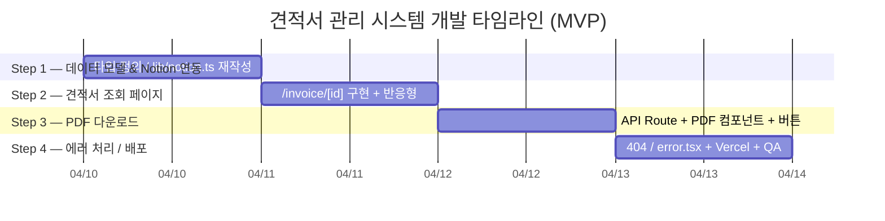
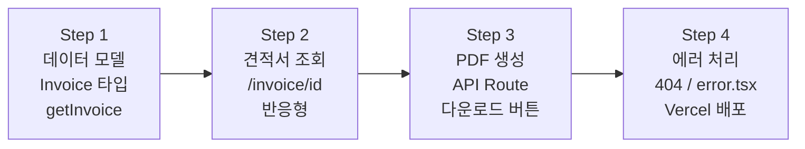

# ROADMAP.md

<!-- Last Updated: 2026-04-15 | Version: 2.3.0 -->

---

## 1. 프로젝트 개요

### 제품 비전

Notion을 데이터베이스로 활용한 견적서 관리 시스템. 관리자는 별도 관리자 UI 없이 Notion에서 견적서를 작성하고, 클라이언트는 고유 URL로 접근하여 견적서를 조회하고 PDF로 다운로드한다.

### 사용자

| 역할 | 설명 |
|------|------|
| 견적서 작성자 (관리자) | Notion에서 견적서를 작성하고 고유 링크를 클라이언트에게 전달 |
| 클라이언트 (수신자) | 링크를 통해 견적서를 조회하고 PDF 다운로드 |

### 핵심 성공 지표 (KPI)

| 지표 | 목표 |
|------|------|
| 견적서 조회 정확성 | Notion 데이터 100% 정상 표시 |
| PDF 다운로드 성공률 | 100% |
| 페이지 로딩 (LCP) | 3초 이하 (Vercel Edge 기준) |
| 잘못된 URL 처리 | 404 에러 페이지 즉시 표시 |
| 반응형 지원 | 모바일(375px) / 태블릿 / 데스크톱 정상 동작 |
| 빌드 성공률 | main 브랜치 100% |

### 기술 스택

| 영역 | 기술 | 버전 |
|------|------|------|
| Framework | Next.js | 16.2.1 |
| Language | TypeScript | ^5 |
| Runtime | React | 19.2.4 |
| CMS | Notion API (`@notionhq/client`) | ^5.15.0 |
| PDF 생성 | @react-pdf/renderer | latest |
| Styling | Tailwind CSS | ^4 (zero-config) |
| UI Components | shadcn/ui | — |
| Icons | Lucide React | ^1.7.0 |
| Testing | Playwright (MCP) | latest |
| Deployment | Vercel | — |

### 팀 구성

1인 개발 (개인 프로젝트). 모든 역할(Frontend, Backend, DevOps)을 단독 수행.

---

## 2. 개발 순서 철학

이 로드맵은 **"의존성 역순으로 막히지 않게"** 원칙으로 구성된다.

```
데이터 모델 → 조회 페이지 → PDF 생성 → 에러 처리 / 배포
```

Notion 타입 정의 없이 조회 페이지를 만들 수 없고, 조회 페이지 없이 PDF 레이아웃을 설계할 수 없다. 에러 처리는 핵심 기능이 완성된 뒤 덧붙이는 것이 디버깅을 단순하게 유지한다.

---

## 3. 마일스톤



---

## 4. 단계별 태스크

---

### Step 1 — 데이터 모델 & Notion 연동

> **왜 이 순서인가?**
> 타입과 데이터 레이어가 없으면 조회 페이지 컴포넌트가 `any` 투성이가 된다. TypeScript strict 모드 아래서는 타입을 먼저 확정해야 이후 작업이 컴파일 에러 없이 진행된다.

**상태**: 🟡 부분 완료 (.env.example 미완료)

#### 기존 코드 처리

| 파일 | 처리 방법 | 상태 |
|------|----------|------|
| `lib/notion.ts` | `getPosts()`, `getPostBySlug()` 등 블로그 함수 제거. `getInvoice(pageId)` 신규 작성. Notion 클라이언트 초기화 로직은 재사용 | ✅ 완료 |
| `types/notion.ts` | `NotionPost`, `NotionBlock` → `Invoice`, `InvoiceItem`, `NotionBlock` 타입으로 교체 | ✅ 완료 (`types/invoice.ts` 신규 생성) |
| `app/page.tsx`, `app/posts/`, `app/category/` | 제거 (견적서 시스템에 불필요한 블로그 라우트) | ✅ 완료 |
| `app/layout.tsx` | 메타데이터를 견적서 시스템으로 교체 | ✅ 완료 |
| `app/page.tsx` | `/invoice`로 redirect하는 페이지로 대체 | ✅ 완료 |
| `.env.example` | `NOTION_TOKEN` → `NOTION_API_KEY` 키 이름 통일 (PRD 기준) | 🔲 미완료 |

#### 타입 정의 (`types/invoice.ts`) — ✅ 완료

| Task | 복잡도 | 비고 | 상태 |
|------|--------|------|------|
| `Invoice` 타입 정의 (id, invoice_number, client_name, issue_date, valid_until, total_amount, status) | S | Notion 속성과 1:1 매핑 | ✅ |
| `InvoiceItem` 타입 정의 (id, description, quantity, unit_price, amount) | S | Relation 데이터베이스 대응 | ✅ |
| `InvoiceStatus`, `STATUS_MAP` 정의 | S | 상태 enum 및 한국어 레이블 매핑 | ✅ |

#### Notion 연동 (`lib/notion.ts` 재작성) — ✅ 완료

| Task | 복잡도 | 비고 | 상태 |
|------|--------|------|------|
| `getInvoice(pageId: string)` — `pages.retrieve()` 기반 단건 조회 | M | v5 SDK pages.retrieve 사용. `getTitle`, `getRichText`, `getDate`, `getStatus`, `getRollupNumber`, `getRelationIds`, `getNumber`, `getFormulaNumber` 헬퍼 함수 작성 | ✅ |
| Items Relation DB 병렬 조회 — Invoices "항목" Relation 필드에서 페이지 ID 배열 추출 후 `Promise.all()`로 각 항목을 `pages.retrieve()`로 조회 | M | Q1 해결로 확정된 방식. 실제 동작 확인 완료 | ✅ |
| Notion 속성 → `Invoice` 타입 변환 헬퍼 | S | v5 API 타입 기반 파싱 헬퍼 함수군 | ✅ |
| 존재하지 않는 pageId → null 반환 처리 (`APIErrorCode.ObjectNotFound`) | S | 404 분기를 위한 명시적 처리 | ✅ |
| 잘못된 pageId 형식 검증 (32자 hex / UUID 정규식) | S | API 호출 생략으로 불필요한 Notion 요청 제거 | ✅ |
| 기타 에러 → `console.error` + null 반환 | S | | ✅ |
| 블로그 함수 전부 제거 (`getPosts`, `getPostBySlug` 등) | S | | ✅ |

**완료 기준**: `getInvoice('valid-page-id')`가 올바른 `Invoice` 객체를 반환하고, 잘못된 ID에서 null을 반환한다. — **달성됨. 브라우저에서 실제 Notion 데이터 조회 및 렌더링 확인.**

---

### Step 2 — 견적서 조회 페이지

> **왜 이 순서인가?**
> 시스템의 핵심 가치는 "클라이언트가 링크로 견적서를 확인하는 것"이다. PDF는 그 다음 부가 기능이다. 조회 페이지가 없으면 PDF 레이아웃을 무엇을 기준으로 설계할지도 알 수 없다.

**상태**: ✅ 완료 (2026-04-10)

| Task | 복잡도 | 기능 ID | 상태 |
|------|--------|---------|------|
| `app/invoice/[id]/page.tsx` 서버 컴포넌트 생성 (Next.js 16 `params: Promise` 패턴 적용) | M | F001, F002 | ✅ 완료 |
| 견적서 헤더 UI (견적서번호, 거래처명, 발행일, 유효기간, 상태 배지) | S | F002 | ✅ 완료 |
| 항목 테이블 UI (품목명, 수량, 단가, 금액, 합계) | M | F002 | ✅ 완료 |
| 반응형 레이아웃 (모바일 375px ~ 데스크톱, `overflow-x-auto` 처리) | S | F012 | ✅ 완료 |
| 존재하지 않는 ID → `notFound()` 호출 | S | F011 | ✅ 완료 |
| `generateMetadata()` — 실제 `invoice_number` 기반 페이지 제목 | S | — | ✅ 완료 |
| **mock 데이터 → 실제 `getInvoice()` 연동** | M | F001 | ✅ 완료 |

**완료 기준**: 유효한 Notion 페이지 ID로 접근 시 견적서 정보가 정확히 표시되고, 없는 ID는 404 페이지로 이동한다. — **달성됨. 브라우저에서 실제 Notion 데이터 렌더링 확인, notFound() 동작 확인.**

---

### Step 3 — UI/UX 개선 + PDF 다운로드

> **왜 이 순서인가?**
> 현재 견적서 페이지는 기능이 동작하지만 UI/UX가 기본 수준이다. PDF 레이아웃은 웹 뷰 구조를 기반으로 설계하므로, 웹 UI를 먼저 확정한 뒤 PDF를 만드는 것이 이중 수정을 방지한다.

**상태**: ✅ 완료 (2026-04-14)

#### UI/UX 개선 (우선순위 1 — PDF 전에 먼저)

| Task | 복잡도 | 비고 | 상태 |
|------|--------|------|------|
| 실제 견적서 문서 레이아웃으로 개선 (회사 정보 섹션, 수신자 정보 섹션) | M | 인쇄/PDF에 적합한 구조 | ✅ |
| 금액 포맷: `₩` 기호 + 천 단위 구분자 | S | `formatKRW` 유틸 사용 | ✅ |
| 상태 배지 디자인 개선 (색상 코딩) | S | pill 형태, draft/sent/done 색상 코딩 | ✅ |
| 모바일 375px 레이아웃 세부 조정 | S | 카드/테이블 이중 렌더링 전략 | ✅ |
| PDF 다운로드 버튼 위치 확정 (헤더 우측 상단 권장) | S | 액션 바 우측, filled dark 스타일 | ✅ |
| 다크모드 기본 탑재 (`html.dark` 고정, `@custom-variant dark`, 전체 `dark:` 클래스 적용) | S | Tailwind v4 class 기반, 항상 다크 | ✅ |

#### PDF API Route (우선순위 2 — UI 확정 후)

| Task | 복잡도 | 비고 | 상태 |
|------|--------|------|------|
| `@react-pdf/renderer` 설치 + Next.js 16 호환성 검증 | S | 문제 시 `pdf-lib` 대체 검토 | ✅ |
| `InvoicePDF` 컴포넌트 (`Document`, `Page`, `View`, `Text`) — A4 인쇄 레이아웃 | M | CSS-in-JS(StyleSheet) 기반, 웹 CSS 미지원 | ✅ |
| `app/api/generate-pdf/route.ts` — POST 핸들러, `invoiceId` 수신 후 Notion 조회 → PDF 반환 | M | Content-Type: application/pdf | ✅ |
| 항목 테이블 PDF 렌더링 | M | | ✅ |

#### 다운로드 버튼

| Task | 복잡도 | 비고 | 상태 |
|------|--------|------|------|
| `PdfDownloadButton` 클라이언트 컴포넌트 (`'use client'`) | S | fetch POST → Blob → URL.createObjectURL → 자동 다운로드 | ✅ |
| 로딩 상태 표시 (다운로드 중 버튼 비활성화) | S | | ✅ |

#### PDF 렌더링 버그 수정 (#18 — 2026-04-14 발견)

| Task | 복잡도 | 비고 | 상태 |
|------|--------|------|------|
| [BUG-1] 주소 텍스트 줄바꿈 — `issuerBlock` 고정 너비 적용 | S | "테헤란로 / 123,4층" 2줄 분리 | ✅ |
| [BUG-2] 이메일 하이픈 기준 줄바꿈 — `Font.registerHyphenationCallback` 등록 | S | "con- / tact@start-..." 5줄로 분리 (가장 심각) | ✅ |
| [BUG-3] 상태 배지("초안") 제거 — 클라이언트 수신 문서에 불필요 | S | 제목 옆 "초안" 배지 표시 | ✅ |
| [BUG-4] 견적서 번호/발행일/유효기간 레이블 폭 통일 — `metaLabel` 고정 너비 | S | "견적서 번호" 레이블이 길어 value 위치 어긋남 | ✅ |
| [BUG-5] 수신자/발행 메타 레이아웃 — column 구조로 변경 (수신↑ 메타↓) | M | 수신자와 날짜가 좌우 나란히 배치됨 | ✅ |
| [BUG-6] 합계 금액 ₩0 → ₩5,000,000 — Rollup 의존 제거, `items.reduce()` 합산 | M | `getRollupNumber` Rollup 파싱 버그 | ✅ |
| [BUG-7] VAT 포함 합계 표시 — 공급가액/부가세/합계(VAT 포함) 3행 구조 | M | 공급가액 ₩5,000,000 + VAT ₩500,000 = **₩5,500,000** | ✅ |

**완료 기준**: 견적서 페이지가 실제 문서처럼 표시되고, "PDF 다운로드" 버튼 클릭 시 A4 포맷의 견적서 PDF 파일이 다운로드된다.

---

### Step 4 — 에러 처리 & 배포

> **왜 이 순서인가?**
> 캐싱과 에러 처리는 기능이 완성된 뒤에 얹는 것이 맞다. 완성되지 않은 기능에 에러 처리를 먼저 추가하면 디버깅이 복잡해진다. 배포는 동작하는 것을 올린다.

**상태**: 🟡 부분 완료 (에러 UI 완료, 배포 미진행)

#### 에러 처리

| Task | 복잡도 | 기능 ID | 상태 |
|------|--------|---------|------|
| `app/not-found.tsx` — "견적서를 찾을 수 없습니다" 안내 + 발행자 문의 가이드 | S | F011 | ✅ 완료 |
| `app/error.tsx` — Notion API 실패 시 폴백 UI (`unstable_retry` 패턴, Next.js 16.2.0) | S | — | ✅ 완료 |
| `lib/notion.ts` 함수에 try/catch + 콘솔 로깅 추가 | S | — | ✅ 완료 |

#### Vercel 배포

| Task | 복잡도 | 비고 | 상태 |
|------|--------|------|------|
| Vercel 프로젝트 생성 및 GitHub 연동 | S | | 🔲 |
| Vercel 환경 변수 설정 (`NOTION_API_KEY`, `NOTION_DATABASE_ID`) | S | | 🔲 |
| `next build` 로컬 통과 확인 | S | 현재 이미 통과 확인됨 | ✅ |
| Playwright MCP E2E 검증 | M | TC-01~05 전체 통과 (2026-04-15) | ✅ |

**완료 기준**: 전체 Playwright 스위트 통과, Vercel 프로덕션 URL에서 실제 Notion 견적서가 정상 표시되고 PDF 다운로드 성공.

---

## 5. 기술 아키텍처 결정 사항 (ADR)

### ADR-001: App Router 채택

**상태**: 결정됨 (기존 유지)
**결정**: `app/` 디렉터리, 서버 컴포넌트 기본, Promise-based params.
**근거**: Next.js 16에서 Pages Router는 레거시 경로. 장기 유지보수 측면에서 App Router가 표준.

---

### ADR-002: Notion pages.retrieve() 기반 단건 조회

**상태**: 결정됨
**컨텍스트**: `@notionhq/client` v5에서 `databases.query()`가 제거되었다. 그러나 견적서 시스템은 목록 조회가 아닌 **페이지 ID로 단건 조회**이므로 `pages.retrieve(pageId)`가 유일한 적합한 API다.
**결정**: URL의 `[id]` 파라미터를 Notion 페이지 ID로 직접 사용. `pages.retrieve()` + `blocks.children.list()`로 데이터 조회.
**근거**: v5 SDK 공식 지원 API. 목록 조회 없이 단건 조회만으로 요구사항 충족.
**트레이드오프**: Notion 페이지 ID가 URL에 노출됨. 견적서 특성상 링크를 받은 사람만 접근하므로 보안상 허용. **향후 개선 필요**: 접근 제한이 필요해지면 짧은 토큰 + 서버사이드 매핑 레이어 추가.

---

### ADR-003: PDF 생성 — @react-pdf/renderer

**상태**: 결정됨
**결정**: `@react-pdf/renderer`를 사용하여 React 컴포넌트로 PDF 레이아웃 정의. `app/api/generate-pdf/route.ts`에서 서버사이드 생성.
**근거**: Vercel 서버리스 환경 친화적. 크로미움 바이너리 의존성 없음. React 컴포넌트 패러다임 유지.
**트레이드오프**: 웹 CSS(Flexbox 외) 미지원 — `StyleSheet.create()` API로 별도 스타일 작성 필요. 웹 뷰와 PDF 뷰 레이아웃 코드가 분리됨.
**기각된 대안**: Puppeteer — 크로미움 바이너리 크기로 Vercel 50MB 제한 초과 위험. 서버리스 환경 설정 복잡.

---

### ADR-004: PDF 생성을 API Route에서 처리

**상태**: 결정됨
**결정**: PDF 생성 로직을 `app/api/generate-pdf/route.ts` 서버사이드에서 처리. 클라이언트는 POST 요청 후 Blob을 수신.
**근거**: Notion API 키를 클라이언트에 노출하지 않음. 무거운 PDF 렌더링 연산을 서버에서 처리.
**기각된 대안**: 클라이언트사이드 PDF 생성 — API 키 노출, 브라우저 메모리 부담.

---

## 6. 리스크 레지스터

| # | 리스크 | 영향도 | 발생 가능성 | 완화 전략 |
|---|--------|--------|-------------|-----------|
| R1 | Notion 페이지 ID 형식 변경 (UUID vs 32자 hex) | High | Low | **완화 조치 적용됨** — `lib/notion.ts`에 32자 hex / UUID 정규식 검증 추가. 형식 불일치 시 API 호출 없이 즉시 null 반환. |
| R2 | Notion API v5 추가 파괴적 변경 | High | Medium | 코드 작성 전 `node_modules/next/dist/docs/` 및 `@notionhq/client` CHANGELOG 확인 |
| R3 | @react-pdf/renderer Next.js 16 호환성 문제 | Medium | Medium | 설치 후 즉시 간단한 PDF 렌더링 테스트. 문제 시 `pdf-lib` 대체 검토 |
| R4 | Vercel 함수 타임아웃 (기본 10초) — 복잡한 견적서 PDF 생성 지연 | Medium | Low | PDF 생성 시간 측정 후 필요 시 `maxDuration` 설정 (Pro 플랜 필요) |
| R5 | ~~Notion Relation 데이터베이스 항목 조회 방식~~ | ~~High~~ | ~~Medium~~ | **해결됨 (Q1 연동)** — Items DB는 별도 Relation DB. Invoices "항목" 필드에서 페이지 ID 배열 추출 후 각 항목을 `pages.retrieve()`로 조회하는 방식으로 확정. |
| R6 | 환경 변수 미설정으로 프로덕션 배포 실패 | High | Low | `.env.example` + 배포 체크리스트 |
| R7 | Playwright MCP 세션 사용 불가 | Medium | Low | CLI `npx playwright test`를 백업으로 사용 |

---

## 7. 완료 기준 및 품질 게이트

### 단계별 완료 게이트



### MVP 성공 기준 (PRD 기준)

| # | 기준 | 검증 방법 |
|---|------|----------|
| 1 | Notion 데이터베이스에서 견적서 정보를 정상적으로 가져옴 | Playwright: 실제 Notion 페이지 ID로 조회 |
| 2 | 고유 URL로 접근 시 견적서가 웹에서 정확하게 표시됨 | Playwright: 항목, 금액, 날짜 렌더링 확인 |
| 3 | PDF 다운로드 버튼 클릭 시 견적서가 PDF로 다운로드됨 | Playwright: 다운로드 이벤트 캡처 |
| 4 | 모바일 / 태블릿 / 데스크톱에서 정상 작동 | Playwright: 375px, 768px, 1280px 뷰포트 |
| 5 | 잘못된 URL 접근 시 적절한 에러 메시지 표시 | Playwright: 없는 ID → 404 확인 |

### 코드 품질 기준

- **TypeScript**: `strict: true` 기준 컴파일 에러 0건
- **ESLint**: `next lint` 경고 없음
- **콘솔 에러**: 브라우저/서버 콘솔 에러 0건 (프로덕션 빌드 기준)
- **주석**: why 위주, what 설명 지양

### 배포 전 체크리스트

- [ ] Notion Integration이 견적서 데이터베이스에 공유되어 있는지 확인
- [ ] `NOTION_API_KEY` Vercel 환경 변수 설정
- [ ] `NOTION_DATABASE_ID` Vercel 환경 변수 설정
- [ ] `next build` 로컬 에러 없이 완료
- [ ] 유효한 견적서 ID로 웹 조회 확인
- [ ] PDF 다운로드 파일 내용 정확성 확인
- [ ] 모바일(375px) 레이아웃 확인
- [ ] 없는 ID 접근 시 404 페이지 동작 확인
- [ ] Notion API 에러 시 error.tsx 폴백 동작 확인
- [ ] 전체 Playwright 스위트 통과

---

## 8. 미결 사항 및 가정

### 확인 필요 사항

| # | 질문 | 중요도 | 상태 |
|---|------|--------|------|
| Q1 | Notion 견적서 항목(Items)이 Relation DB인지, 아니면 견적서 페이지 내 블록(테이블)으로 관리되는지? | **High — 데이터 조회 방식 결정에 영향** | ✅ **해결됨** — Relation DB 방식으로 확인. Invoices DB의 "항목" 컬럼 = Relation (Items DB 페이지 ID 배열). Items DB 컬럼: 항목명(Title), Invoices(Relation), 단가(Number), 수량(Number), 금액(Formula: 단가×수량). 총금액 = Rollup (Items.금액 합산) |
| Q2 | 견적서 URL에 Notion 페이지 ID를 그대로 노출해도 되는지, 아니면 별도 짧은 ID가 필요한지? | Medium | 미결 |
| Q3 | PDF에 로고 이미지나 회사 도장 이미지가 포함되어야 하는지? | Medium | 미결 |
| Q4 | 견적서 상태(Status)에 따라 표시 여부를 제어해야 하는지? (예: "거절" 상태 견적서는 조회 불가) | Medium | 미결 |
| Q5 | 다국어 지원이 MVP에 필요한지? (현재 PRD에는 MVP 이후로 분류) | Low | 미결 |

### 적용한 가정

1. **Notion 페이지 ID = 견적서 URL ID**: Notion URL의 32자 hex ID를 그대로 라우트 파라미터로 사용.
2. **항목 데이터는 Relation DB**: `InvoiceItem` 타입을 Relation DB 조회 기준으로 설계. **CSV 분석으로 확인됨 (Q1 해결)** — Items DB는 별도 데이터베이스이며 Invoices와 Relation으로 연결됨.
3. **인증 불필요**: MVP에서는 링크를 가진 사람이면 누구나 접근 가능 (PRD 기준).
4. **한국어 고정**: 다국어 지원 없이 한국어 단일 로케일.
5. **shadcn/ui 최소 활용**: 필요한 경우에만 채택, 기본 Tailwind 컴포넌트 우선.
